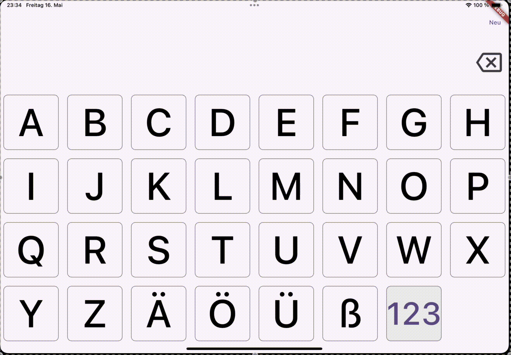

<h1 align="center">
bigK
    
</h1>

Big keyboard. Keep it simple: just type and output.

    

## Feature Ideas
- Keyboard Layouts
- Language specific characters
- Settings for button size, language, etc.